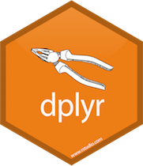

```{r setup, message=FALSE, include = FALSE}
options(htmltools.dir.version = FALSE)
library("jrPresentation")
library("emo")
set_presentation_options(page_numbers = FALSE)
```


layout: true
`r add_border(inverse=FALSE)`
---
class: middle center

# A data science workflow

```{r, echo = FALSE}
knitr::include_graphics("assets/data-science-workflow.png", )
```

---

# The Challenge

* Choose one of the following data sets
    * ONS Conceptions data (2017)
    * English indices of deprivation (2019)

--

* Do some analysis
    * Plots
    * Summary statistics
    * Tables
    * Text
    * Statistical tests
    * Linear regression
    * Maps

--

* Communicate your findings
    * R Markdown document
    * R Markdown presentation
    * Flexdashboard
    * Shiny app

---

# Data set one: Conceptions in England and Wales

* [ONS website](https://www.ons.gov.uk/peoplepopulationandcommunity/birthsdeathsandmarriages/conceptionandfertilityrates/datasets/conceptionstatisticsenglandandwalesreferencetables)

* This requires some wrangling to get into long form

* I've pre-processed table 1a, and 6 for you

* If you want to use the other tables- you'll have to process them yourselves!

* Code is in the repo

---

# Data set two: English indices of deprivation 2019

* [National Statistics](https://www.gov.uk/government/statistics/english-indices-of-deprivation-2019)

* Created by the Ministry of Housing, Communities & Local Government

* LSOA level data, IMD rank, IMD decile, and rank and decile for each domain

* Additional info available online
    * Population demographics
    * LA aggregated data
    * CCG aggregated data

---
class: middle, center
# Examples

---

# Use your skills

```{r, echo = FALSE}
knitr::include_graphics("assets/all_hexes.png")
```

---

# Tips `r emo::ji("bulb")`

* Pair programme - two/three to a laptop

* Start wide - then focus in

* Think about the story you are trying to tell

* Divide the work, one pair analyse, the other pair plan the communication

---

# Useful resources  `r emo::ji("books")`

* RStudio cheatsheets 

* RMarkdown templates

* [Templates / examples online](https://shiny.rstudio.com/gallery/)

* Each other!

* [Stack overflow](https://stackoverflow.com/questions/tagged/r?tab=Newest)

* (Me and Theo)

---

# Plan for the day `r emo::ji("clock")`

* 09:30 - 10:00 Introduction
* 10:00 - 11:00 Exploratory analysis
* 11:00 - 11:15 Re-group for questions
* 11:15 - 11:30 Break
* 11:30 - 12:30 Start 
* 12:30 - 13:30 Lunch
* 13:30 - 15:00 Work on slides
* 15:00 - 15:15 Break
* 15:15 - 16:15 Presentations
* 16:15 - 16:30 Wrap up

---


.pull-left[

```{r, echo = FALSE, out.width = "100px", fig.align="left"}

```

* A
* B
* C
* D
* E


```{r, echo = FALSE, out.width = "100px", fig.align="left"}

```

* A
* B
* C
* D
* E


]

.pull-right[


```{r, echo = FALSE, out.width = "100px", fig.align="left"}

```


* A
* B
* C
* D
* E


```{r, echo = FALSE, out.width = "100px", fig.align="left"}
knitr::include_graphics("assets/ggplot2.png")
```


* A
* B
* C
* D
* E


]

---
class: middle center


# [github.com/trianglegirl/gmhsc-workshop-1](https://github.com/trianglegirl/gmhsc-workshop-1)

