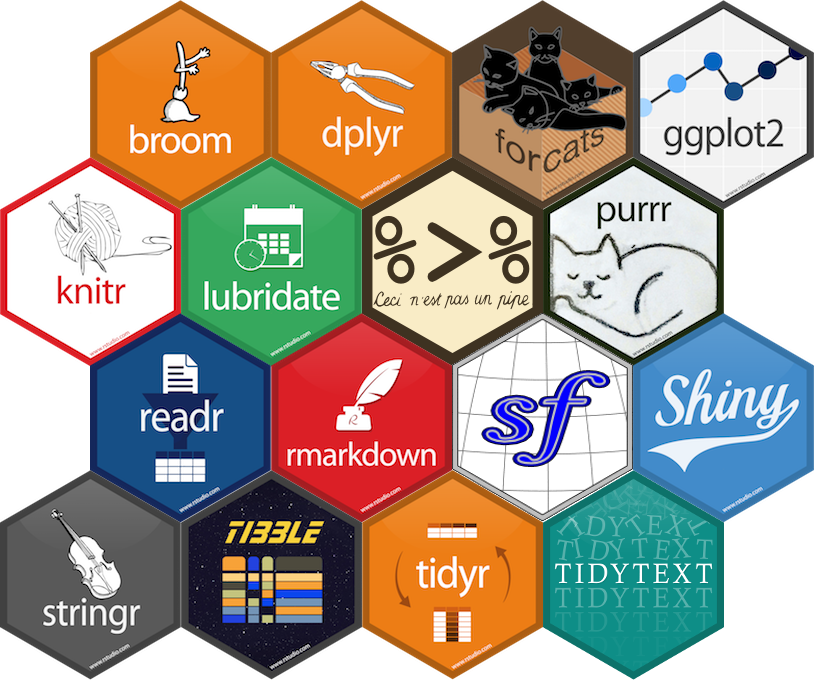

```{r setup, message=FALSE, include = FALSE}
options(htmltools.dir.version = FALSE)
library("jrPresentation")
library("emo")
set_presentation_options(page_numbers = FALSE)
```


layout: true
`r add_border(inverse=FALSE)`
---


# The Challenge

* Choose one of the following data sets
    * ONS Conceptions data (2017)
    * Indices of deprivation 2019

--

* Do some analysis
    * Plots
    * Summary statistics
    * Tables
    * Text
    * Statistical tests
    * Linear regression
    * Maps

--

* Communicate your findings
    * R Markdown document
    * R Markdown presentation
    * Flexdashboard
    * Shiny app

---

# Data set one: Conceptions in England and Wales

* [ONS website](https://www.ons.gov.uk/peoplepopulationandcommunity/birthsdeathsandmarriages/conceptionandfertilityrates/datasets/conceptionstatisticsenglandandwalesreferencetables)

---

# Data set two

---


# Use your skills

```{r, echo = FALSE}

```

---

# Tips

* Pair programme - two/three to a laptop
* Start wide - then focus in
* Think about the story you are trying to tell
* Divide the work, one pair analyse, the other pair plan the communication

---

# Useful resources

* ONS geoportal
* RStudio cheatsheets
* Stackover flow
* Each other!
* (Me and Theo)

---

# Plan for the day `r emo::ji("clock")`

* 09:30 - 10:00 Introduction
* 10:00 - 11:00 Exploratory analysis
* 11:00 - 11:15 Re-group for questions
* 11:15 - 11:30 Break
* 11:30 - 12:30 Start 
* 12:30 - 13:30 Lunch
* 13:30 - 15:00 Work on slides
* 15:00 - 15:15 Break
* 15:15 - 16:15 Presentations
* 16:15 - 16:30 Wrap up

---

# Your groups


.pull-left[
A
B
C
D
E
]

.pull-right[
A
B
C
D
E
]

